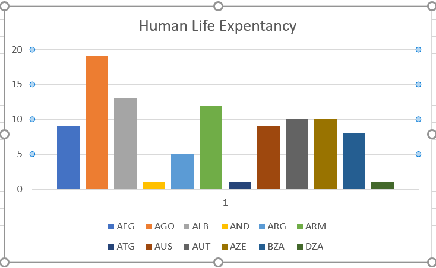

# Shabnam_mapreduce_Human life Expectancy
MapReduce for large datasets.
## About Data
This dataset is a collection of few countries with region wise human life expectancy. The human lifespan is the maximum number of years an individual from the human species can live based on observed examples.

DateSet Source: ***[Link](https://www.kaggle.com/deepcontractor/human-life-expectancy-around-the-world)*** 
## Commands Used:
## Powershell Command
For mapperoutput:
cat Food_Preference.csv | python mapper.py > shaikmapperout.txt
To sort data:
cat Human_life_Expentancy.csv | python mapper.py | sort  | python reducer.py > shaikreduceroutput.txt

## Question to be answered
Which country has the highest human life expectancy among different countries over wide?
## Summary
By MapReducing, I have sorted the data with ***keyvalue 1***. Total of 105 datasetcells data is reduced to top 12 dataset cells with ***keyvalue - Country***. 

**Solution**: From the Chart and ReducerOutput, we can say that AGO(Angola) has the highest life expentacy rate among all the countries.

 

